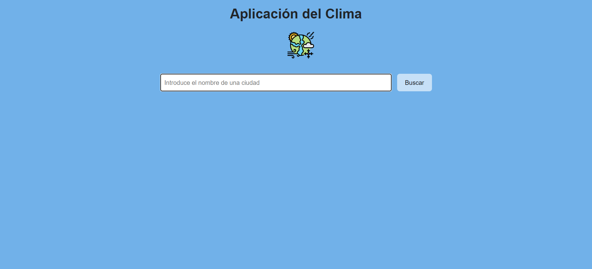
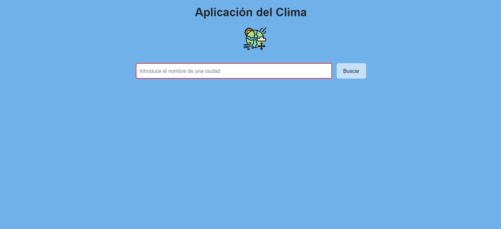
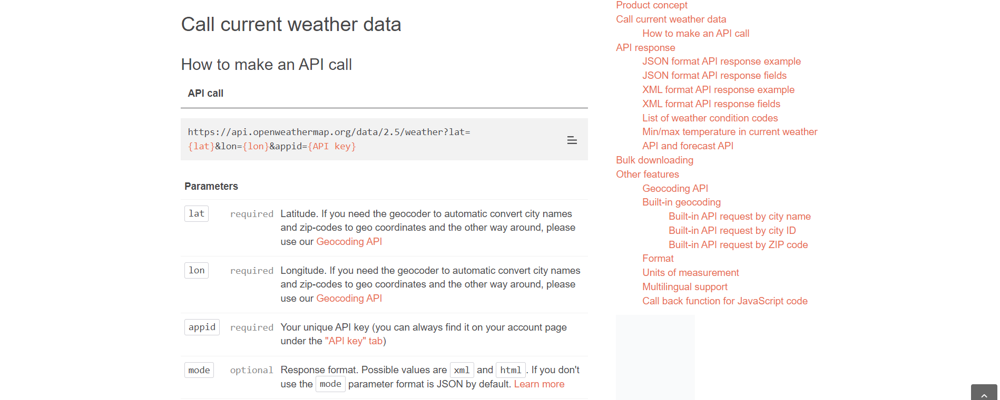
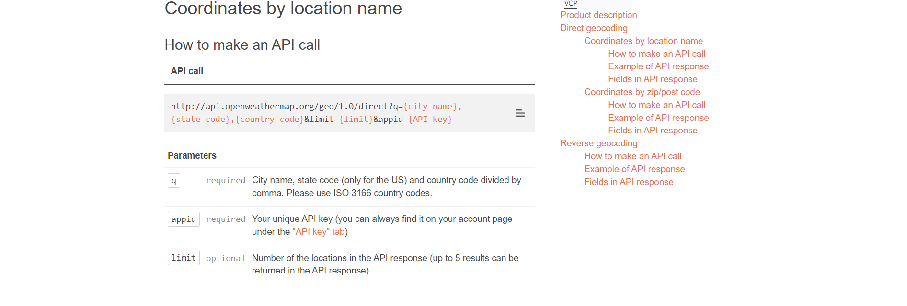
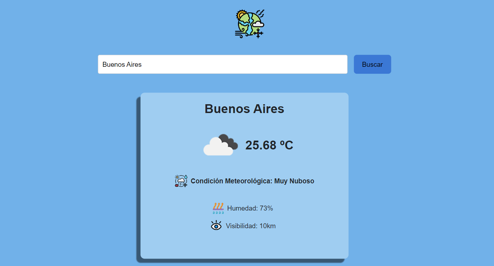
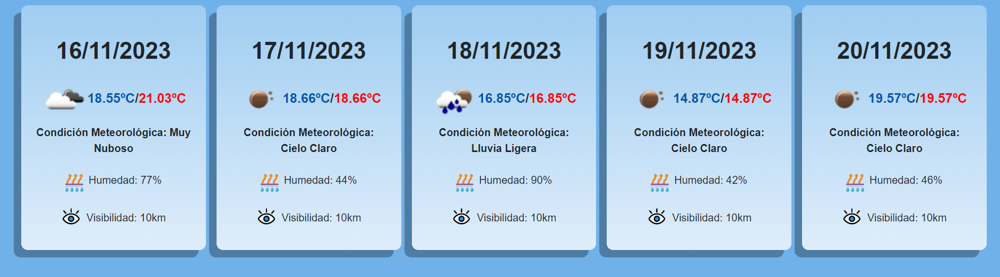
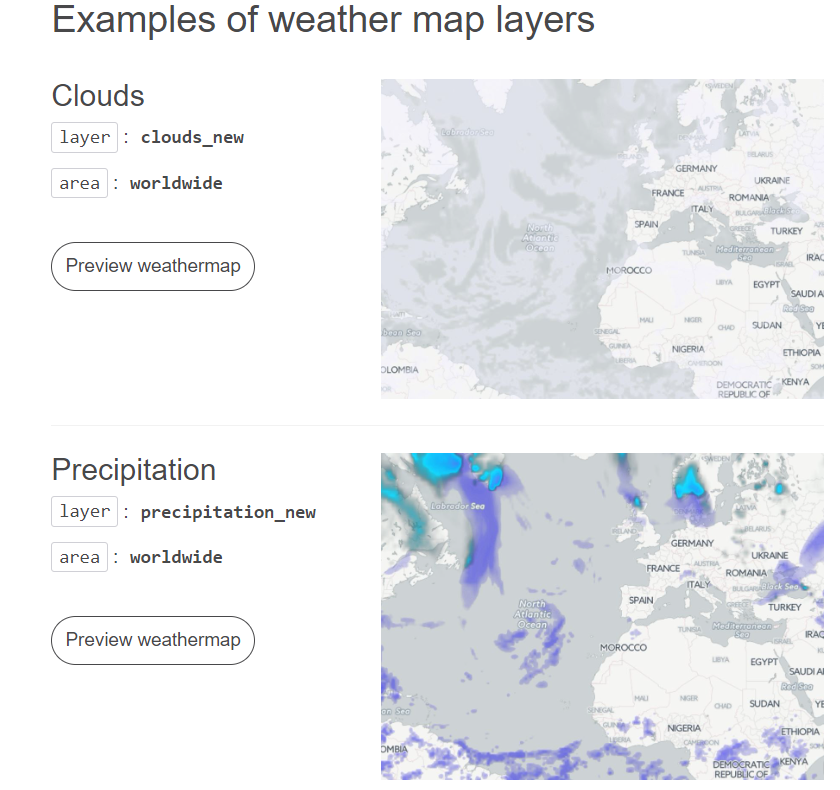
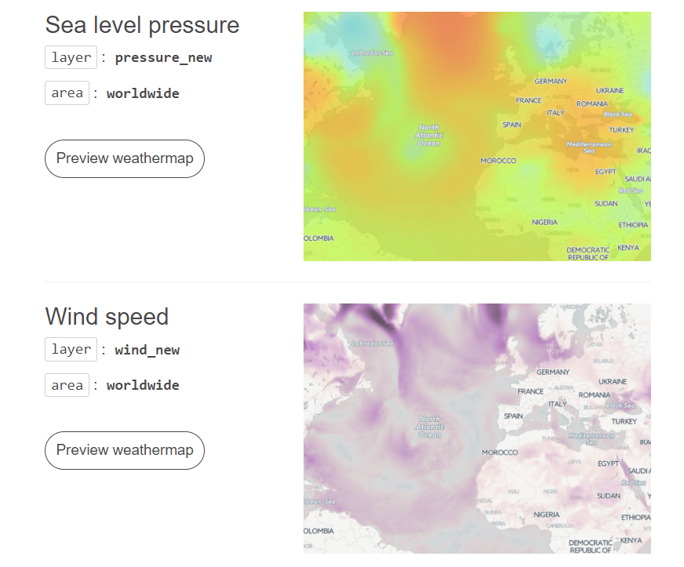
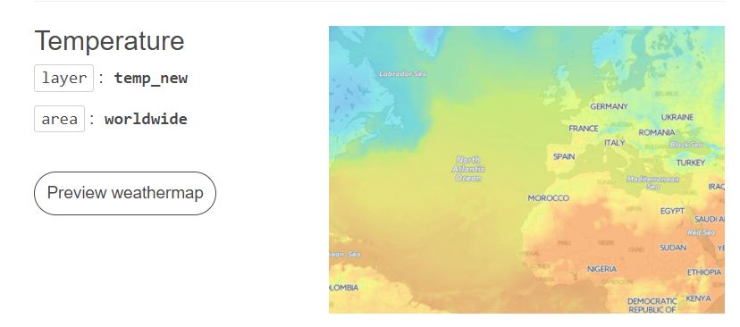
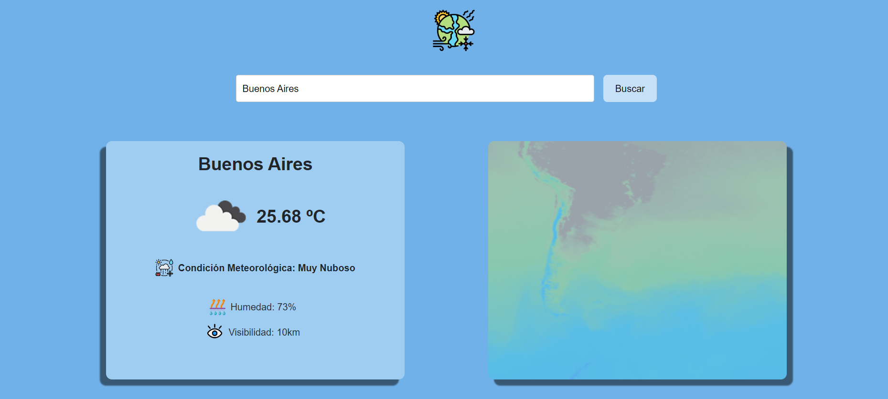

# weather-app

## Introducción

Luego de varios meses aprendiendo React.js mediante cursos gratuitos, cursos pagos, videos de YouTube y leyendo documentación, me animé a desarrollar 
mi primera aplicación usando esta tecnología. Me decanté por una app sobre el clima porque me pareció una buena forma de poner en práctica mucho del 
contenido que aprendí, tal vez no sea algo tan complejo pero sí desafiante. Me crucé con muchos problemas en el camino que, con más o menos perseverancia
y dandome mucha maña, pude resolver. Cada error me llevó a una solución y esa solución se convirtió en un nuevo conocimiento.

# Inicio del desarrollo del sitio

Al principió estaba un poco perdido por donde arrancar, asi que busqué varios sitios webs sobre el pronósticos del tiempo para orientarme un poco con el
diseño y en la información que se suele mostrar (temperatura, viento, humedad, visibilidad, etc). 

Una vez ya resuelto eso, me quedaba buscar una API que me sirviera para obtener toda esa información. Buscando y leyendo recomendaciones me encontré con la
API de https://openweathermap.org/ la cual es muy completa y cuenta con varias funciones gratuitas interesantes.

## Proceso de creación

Comencé con lo básico: un form, un input y un button para que el usuario busque la ciudad de la que quiera saber el tiempo. También hice una validación de 
entrada para que si o si tenga que haber algo escrito en el input. 

## Input



## Validación del input



El siguiente paso era llamar a la API de Open Weather Map para mostrar la información de la ciudad ingresada.
Esta fue la que use:



En este punto fue cuando ocurrió el primer problema, y es que para obtener los datos del tiempo de una ciudad con esa API primero necesitaba obtener las
coordenadas de la ciudad ingresada. Por lo tanto para usar esa API primero tenia que usar otra de geolocalización:



Una vez que ya tenia las coordenadas podía acceder a los datos del tiempo de la ciudad que ingresaba el usuario, le agregué estilos y algunos iconos para
mejorar el diseño de la app y quedó asi:



Al principio pensé: "Listo, ya está, quedó bien." Pero luego me pareció que había quedado algo simple y quería hacer algo más desafiante y complejo. Por lo que
me base en otras páginas del tiempo y se me ocurrió agregar el pronostico extendido con los próximos 5 días.

Para hacer esto, usé otra API de Open Weather Map que te daba los datos de los siguientes 5 días, también hay una API paga que te devuelve la información de
los próximos 16 días.

Pasé por varios problemas al hacer esto ya que al principió me devolvía varios datos del mismo día 5 veces. Para resolver esto leí de arriba a abajo la documentación
de la API y de algún que otro blog que encontré, ya que la documentación de esta API al ser gratuita hay muchas cosas que no se explican, como sí en las pagas.

Una vez resuelto el problema quedó así:



Por último, leí que Open Weather Map tenía una API sobre distintos mapas a nivel mundial que mostraban la temperatura, el nivel del mar, el viento, las precipitaciones
y las nuubes:







Yo me decidí por obtener el mapa sobre la temperatura, la idea era que el mapa muestre la zona de la ciudad que ingresaba el usuario en el input. Sin embargo, tuve más
complicaciones de las esperadas.

Primero había utilizado un fetch para obtener la información de la API y poder mostrar el mapa, pero esto no resultó. Open Weather Map no devulve un json con los datos del 
mapa, sino que devuelve una img, es por eso que no podía mostrarlo a través del fetch. Es algo que tardé en darme cuenta porque la documentación no lo decía y me enteré 
buscando por internet.

El segundo problema que tuve fue más complicado, ya que resulta que a la url que muestra el mapa hay que pasarle coordenadas mosaico, algo que no sabía cómo hacer. Para
hacerlo tuve que pedirle ayuda a Chat GPT con el código matematico para trasformar la latitud y longitud a coordenadas mosaico y este es el código que me ayudo a lograrlo:

```
const latRad = Math.PI * latLong[0].lat / 180;
const n = Math.pow(2, z);
const x = Math.floor((latLong[0].lon + 180) / 360 * n);
const y = Math.floor((1 - Math.asinh(Math.tan(latRad)) / Math.PI) / 2 * n);

```
Y este fue el resultado final del mapa en mi app:



Tengo que aclarar que el mapa no tiene la mejor resolución ya que es de la API gratuita de la página y la versión 1.0. Hay uno de mejor calidad y más completo en las versión
2.0 pero hay que estar suscripto.

Por último, hice que la aplicación sea responsive a través de los @media con css.

# Lenguajes y tecnologías usados

 


## Links

Link del deployment de Vercel:
https://weather-app-ivanroth000.vercel.app/

Muchas gracias por leer 😊.

